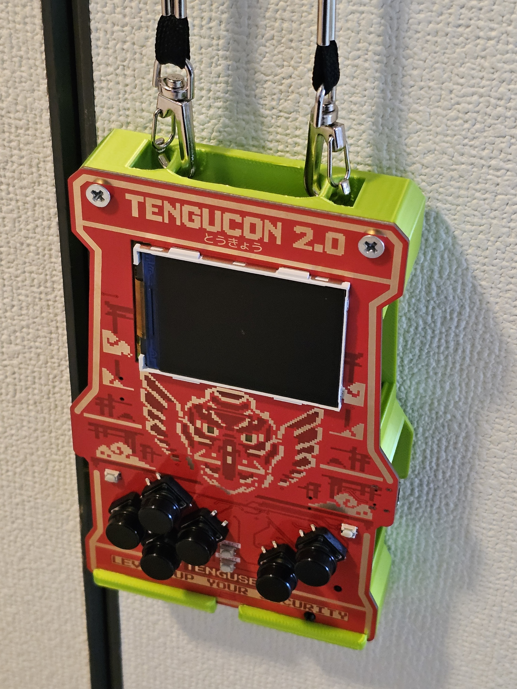

# Tengucon 2.0 Badge Case

Simple case for the Tengucon 2.0 badge.

I printed in PLA with support material, see included images for more info.

Feel free to edit via the step file.

## Hardware Notes

This build used the following parts only because they were on hand; they are **not** specifically recommended:

- https://www.monotaro.com/p/7429/7756/
- https://www.monotaro.com/p/4221/9536/

A better approach might be a snap-on case with no additional hardware.
